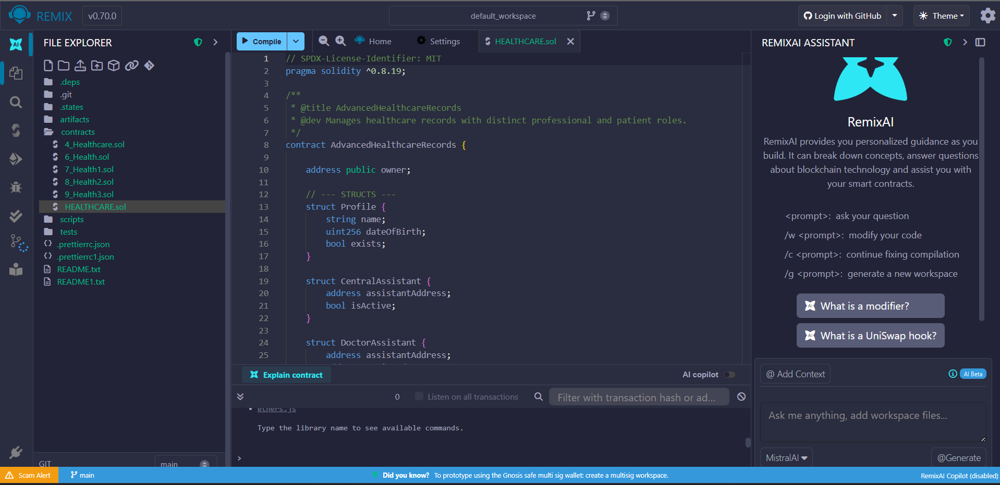
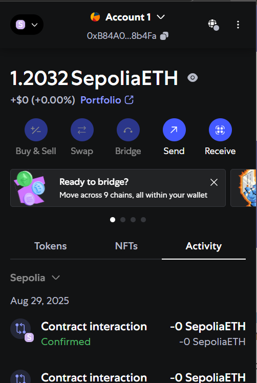
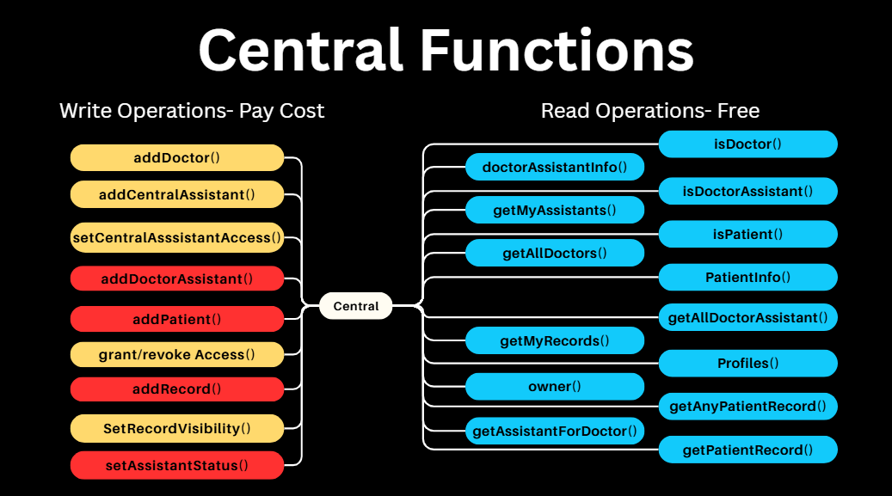
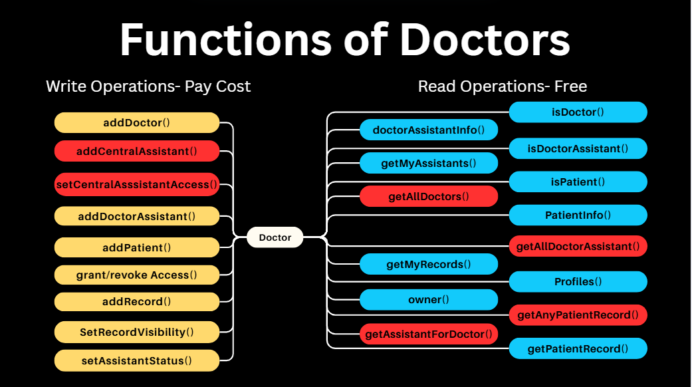
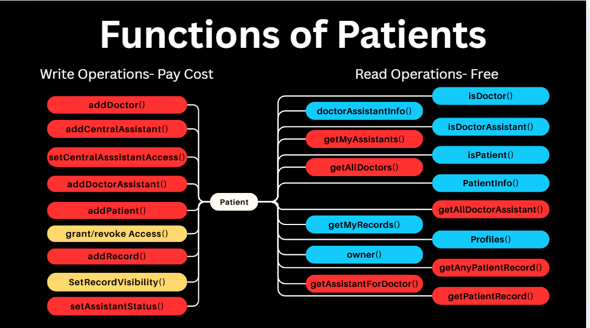

# Blockchain Healthcare Records DApp 🏥

This project is a decentralized application (DApp) for managing electronic health records (EHR) on the Ethereum blockchain. It provides a secure and transparent way for patients, doctors, and administrators to interact with medical data, leveraging smart contracts for role-based access control and data integrity.

## ✨ Features

  * **Role-Based Access Control:** The system defines multiple user roles (Owner, Central Assistant, Doctor, Doctor's Assistant, Patient) with specific permissions.
  * **Decentralized Data Management:** Medical records are stored on the blockchain, ensuring they are tamper-proof and always available.
  * **Patient-Controlled Access:** Patients have full control over which doctors can view their medical history.
  * **Record Privacy:** Patients can set individual records to be public or private.
  * **Hierarchical Administration:** A clear administrative structure allows the owner to manage central assistants, who in turn can manage doctors.
  * **Dockerized Environment:** The application is containerized using Docker for easy setup and deployment.

-----

## 🛠️ Technology Stack

  * **Smart Contract:** Solidity
  * **Frontend:** React.js
  * **Blockchain Interaction:** Ethers.js
  * **Wallet:** MetaMask
  * **Containerization:** Docker, Docker Compose

-----

## 📂 Project Structure

A brief overview of the key files in this project:

```
/
├── public/
├── src/
│ ├── abi.json # Smart contract ABI for frontend interaction.
│ └── Healthcare3.js # Main React component for the UI and DApp logic.
├── Dockerfile # Instructions to build the application's Docker image.
├── docker-compose.yml # Defines and runs the multi-container Docker application.
├── Healthcare.sol # The core Solidity smart contract (Note: The frontend is based on a more advanced version than the one shown).
└── package.json # Project dependencies and scripts.
```

-----

## ⚙️ Setup and Installation

### Prerequisites

  * [Node.js](https://nodejs.org/) and npm
  * [Docker](https://www.docker.com/) and Docker Compose
  * [MetaMask](https://metamask.io/) browser extension

### Steps

1.  **Clone the Repository:**

    ```bash
    git clone https://github.com/sourabhprajapati22/BLOCKCHAIN-HEALTHCARE.git
    cd BLOCKCHAIN-HEALTHCARE
    ```

2.  **Install Dependencies:**

    ```bash
    npm install
    ```

3.  **Deploy Smart Contract:**

      * Compile and deploy the `Healthcare.sol` contract using a development environment like [Remix IDE](https://remix.ethereum.org/) or Hardhat.
      * After deployment, copy the new contract address.

4.  **Update Frontend Configuration:**

      * In `src/Healthcare3.js`, replace the value of `contractAddress` with your newly deployed contract address.
      * Replace the contents of `src/abi.json` with the new ABI generated after compiling your contract.

5.  **Run the Application:**
    Use Docker Compose to build and run the application.

    ```bash
    docker-compose up --build
    ```

    The DApp will be available at `http://localhost:3000`.

-----

## 📖 Usage Walkthrough

### 1\. Smart Contract Deployment (Remix)

Deploy the `Healthcare.sol` contract using Remix IDE to the desired network (e.g., Sepolia Testnet).



### 2\. Connecting Your Wallet

Open the DApp and click the "Connect Wallet" button to link your MetaMask account.



### 3\. Role-Based Functions

#### **Super Admin (Owner)**

The address that deployed the contract is the **Owner**. This role has the highest level of authority.

  * **Add Central Assistant:** Registers a new central assistant who can manage doctors.
  * **Set Central Assistant Status:** Activate or deactivate a central assistant's privileges.



#### **Central Assistant**

A Central Assistant is added by the Owner and is responsible for onboarding doctors.

  * **Add Doctor:** Registers a new doctor's address into the system.


#### **Doctor**

Doctors are added by Central Assistants. They manage patients, assistants, and medical records.

  * **Add Patient:** Registers a new patient under their care.
  * **Add Medical Record:** Creates a new diagnosis and treatment record for a patient.
  * **Add Doctor Assistant:** Onboards an assistant who can act on their behalf.
  * **Set Assistant Status:** Manages the active status of their assistants.



#### **Doctor's Assistant**

A Doctor's Assistant is added by a Doctor and shares some of the doctor's responsibilities.

  * **Add Patient:** Can register new patients for their assigned doctor.
  * **Add Medical Record:** Can add new medical records for patients.


#### **Patient**

Patients have ultimate control over their own data.

  * **Manage Doctor Access:** Grant or revoke a doctor's permission to view their records.
  * **Set Record Visibility:** Toggle a specific record's visibility between public (viewable by any authorized doctor) and private (viewable only by the patient).

# > A project by Ravi and Sourabh


